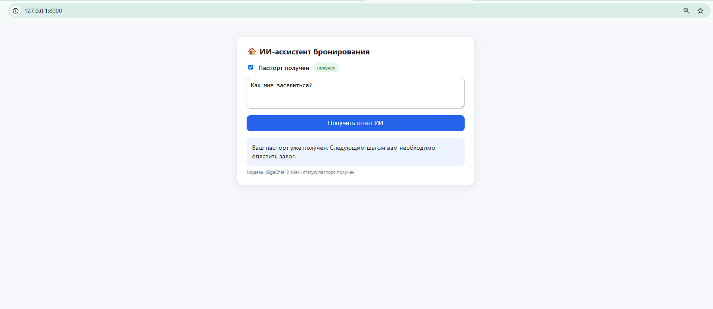
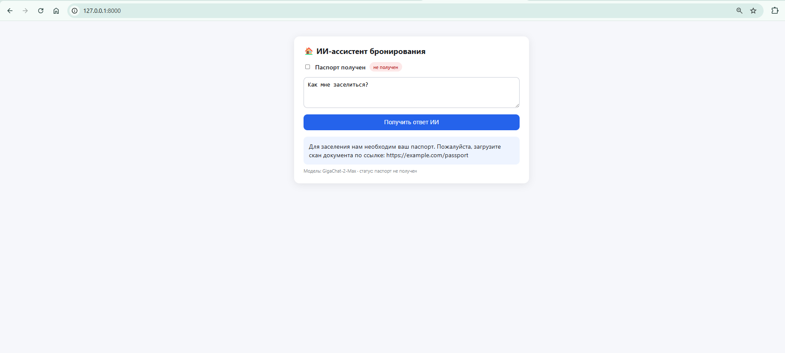
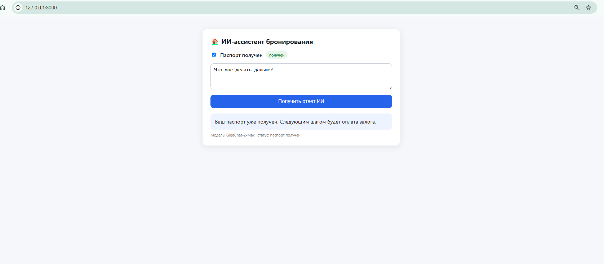

# 🏠 Booking AI Prototype

Прототип ИИ-ассистента сервиса бронирования жилья на базе **FastAPI + GigaChat (Sber)**.

Ассистент общается с гостем на русском языке, знает текущий статус бронирования (паспорт получен / не получен) и ведёт гостя по шагам сценария: предоставление паспортных данных, заезд, ключи, оплата залога.

## Скриншоты






## 🧠 Как это работает

- `POST /api/ask` — принимает вопрос гостя и статус бронирования, возвращает ответ ассистента (GigaChat-2-Max).
- `GET /` — отдаёт простой веб-интерфейс (`index.html`) для диалога с ассистентом.
- Persona и правила сценария заданы системным промптом в `main.py`.

## 🛠 Стек

- Python 3.11+, FastAPI, uvicorn
- GigaChat API (библиотека `gigachat`)
- Деплой: Yandex Cloud Compute (ВМ, Ubuntu)

## 🚀 Локальный запуск

1. Клонируй репозиторий и поставь зависимости:

```bash
    git clone <https://github.com/mikhailstarikov/booking-ai-proto.git>
    cd booking-ai-proto
    python -m venv venv
    pip install -r requirements.txt
```

1. Создай файл `.env` по образцу `.env.example`.

2. Запусти сервер:

```bash
    uvicorn main:app --reload --port 8000
```

## Браузер

Открой<http://127.0.0.1:8000>

## 🔐 Безопасность

Креденшелы в репозиторий не попадают: читаются из переменных окружения / `.env` (файл добавлен в `.gitignore`).

## 📌 Статус

Прототип выполнен как тестовое задание: был развернут на ВМ в Yandex Cloud и продемонстрирован в работе; после демо ВМ выведена из эксплуатации, проект остается открытым прототипом.

## Автор

Михаил Стариков
